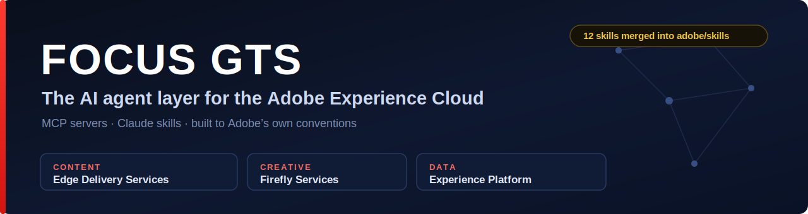

<div align="center">



[](https://github.com/adobe/skills)
[](https://registry.modelcontextprotocol.io)
[](https://github.com/punkpeye/awesome-mcp-servers)
[](https://www.npmjs.com/package/@focusgts/eds-mcp-server)
[](https://www.npmjs.com/package/@focusgts/eds-mcp-server)

**We build the AI agent layer for the Adobe Experience Cloud.**

MCP servers and Claude skills that let AI agents operate Adobe's platforms directly — across content, creative, and customer data. Production-grade, built to Adobe's own conventions, and often the first of their kind.

</div>

---

### ▶ Try it in 30 seconds

```bash
claude mcp add eds -- npx @focusgts/eds-mcp-server
```

Then ask your agent: *"Preview and publish the homepage"* or *"What are the Core Web Vitals for this site?"* — 20 EDS tools, live.

---

### Content — Edge Delivery Services (AEM)

- **[EDS Content Ops Skills](https://github.com/Focus-GTS/eds-content-ops-skills)** — 43 AI skills for Adobe EDS: auditing, SEO, accessibility, structured data, migration, and more. **First third-party contributor merged into [Adobe's official skills repo](https://github.com/adobe/skills).**
- **[EDS MCP Server](https://github.com/Focus-GTS/eds-mcp-server)** — 20 tools for preview, publish, content, analytics, and config. Live in the [official MCP registry](https://registry.modelcontextprotocol.io). The first MCP server purpose-built for EDS.
- **[EDS Ops](https://github.com/Focus-GTS/eds-ops)** — CLI health scanner and GitHub Action for automated site grading and PR gating.
- **[EDS Score](https://www.focusgts.com/eds-score/)** — Free browser-based site health analyzer for EDS sites.

### Creative — Firefly Services

- **[Firefly Services MCP Server](https://github.com/Focus-GTS/firefly-services-mcp)** — 19 tools exposing Firefly, Photoshop API, and Lightroom API to AI agents. Generate, expand, composite, and process images directly from a Claude Code session.
- **[Firefly Services Skills](https://github.com/Focus-GTS/firefly-services-skills)** — 19 Claude skills covering the full Firefly Services lifecycle — auth, generation, custom models, video, Photoshop and Lightroom automation — distilled from real enterprise FDE engagements.

### Data — Adobe Experience Platform

- **[AEP MCP Server](https://github.com/Focus-GTS/aep-mcp-server)** — The first full-featured MCP server for Adobe Experience Platform: full read/write across schemas, datasets, identities, profiles, segments, sources, destinations, and query service.

---

### Also from FocusGTS

- **[Pre-Flight](https://www.focusgts.com/preflight)** — Free AEM Cloud Manager quality gate checker. 104 rules, 1,141 tests, 100% client-side.
- **[Navigator](https://navigator.focusgts.com)** — Managed service for Adobe and Salesforce operations: AI-powered knowledge management, ticket triage, and continuous optimization.

---

### By the Numbers

| | |
|---|---|
| MCP servers | 3 (EDS, Firefly Services, Experience Platform) — 60+ tools |
| AI skills | 62+ across EDS and Firefly Services |
| Merged into adobe/skills | 11 skills — first third-party contributor |
| Distribution | Official MCP registry · Glama · awesome-mcp-servers · npm |
| Adobe coverage | EDS/AEM · Firefly · Photoshop · Lightroom · Experience Platform · Cloud Manager |

---

<div align="center">

**Adobe Silver Solution Partner** · Not affiliated with or endorsed by Adobe Inc.

[focusgts.com](https://focusgts.com) · [Navigator](https://navigator.focusgts.com)

</div>
